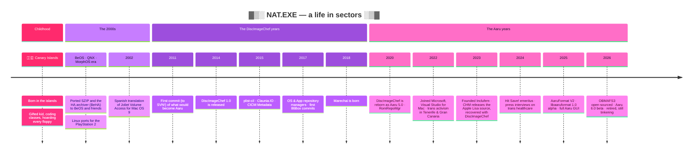

<!-- ░▒▓█  NAT PORTILLO · claunia · TinkeringDaemon  █▓▒░ -->

<div align="center">


<a href="https://github.com/claunia">
  
</a>

<br/>

<a href="https://www.twitch.tv/tinkeringdaemon"></a>
<a href="https://www.youtube.com/@tinkeringdaemon"></a>
<a href="https://bsky.app/profile/claunia.com"></a>
<a href="https://www.instagram.com/tinkeringdaemon/"></a>
<a href="https://x.com/TinkeringDaemon"></a>
<br/>
<a href="https://www.claunia.com"></a>
<a href="https://blog.claunia.com"></a>
<a href="https://linkedin.com/in/nataliaportillo"></a>
<a href="https://www.patreon.com/claunia"></a>
<a href="https://www.flickr.com/photos/claunia"></a>
<a href="https://orcid.org/0009-0006-9008-4165"></a>

<br/><br/>


</div>


## `> whoami`

```csharp
public sealed record NatPortillo : Human, IArchivist, ITechnomancer, IWriter
{
    public string   Pronouns  => "they / them · elle";
    public string   Origin    => "🇮🇨 Canary Islands, Spain";
    public string   HomeBase  => "Las Palmas de Gran Canaria";
    public string[] Roots     => ["Celtic", "Galician"];
    public string   Status    => "Retired engineer · full-time preservationist";
    public string   Identity  => "Non-binary 🏳️‍⚧️ trans fem · queer 🏳️‍🌈";
    public string   System    => "Plural — Sol 🌞 & Luna 🌙";
    public string[] Brain     => ["Autistic", "ADHD", "BPD", "DID", "Intellectually gifted"];
    public string[] Code      => ["C#", "C", "C++", ".NET", "Blazor", "Avalonia", "Uno"];
    public string[] Speaks    => ["Español", "English"];
    public string[] Offline   => ["📸 IR & UV photography", "✍️ writing", "🔮 tarot & runes",
                                  "🕯️ practicing witch", "🔧 soldering", "🎧 dark music"];
    public string   Diet      => "Vegan 🌱";
    public string   Mission   => "Computing history deserves the same care as natural history.";
}
```


## 🌴 Origins: a gifted kid with a hoarding problem

I was **born in the Canary Islands** 🇮🇨, and I've been tinkering with machines for as long as I can remember.
I was recognised as an intellectually gifted child and was put into programming courses before most kids had even
touched a keyboard. From then on I kept *everything*: every component, every manual, every floppy, every cable.
My mother was not exactly thrilled about how much space my "hobby" took up. 📦💾📦💾

That hoarding never stopped. It turned into a lifelong mission: **making sure computing history doesn't rot away on
dying media.** I've been at it since the turn of the century, and it eventually became my biggest and most meaningful
project: **[Aaru](https://github.com/aaru-dps/Aaru)**.

Along the way I crossed the sea to spend a couple of years in the **United Kingdom** 🇬🇧, then came back to Spain and to
the islands where it all started. I spent time with the communities of **Tenerife**, and these days I'm based in
**Las Palmas de Gran Canaria** 🌋🌊.

I spent a few years at **Microsoft** as an engineer in **DevDiv**, working on **Visual Studio for Mac**. That chapter is
closed now. **I'm retired**, and I spend my time on what I love most: preservation, writing, photography, activism,
and breaking open old hardware on stream.

## 🛰️ The journey




## 💿 Aaru Data Preservation Suite — my life's work

<div align="center">

<a href="https://github.com/aaru-dps/Aaru">
  
</a>

<a href="https://github.com/aaru-dps/Aaru/stargazers"></a>
<a href="https://github.com/aaru-dps/Aaru/graphs/contributors"></a>
<a href="https://github.com/aaru-dps/Aaru/commits"></a>


</div>

> *Named after the Egyptian paradise where the righteous dwell eternally, which is exactly where old data deserves to go.*

**Aaru** (formerly **DiscImageChef**) is a fully featured preservation suite. It **dumps, identifies, verifies, converts and
extracts** almost any storage media you can find in a museum, an attic or a dumpster: floppies, hard disks, CDs, DVDs,
Blu-rays, HD DVDs, magneto-opticals, flash, memory cards and tapes. It talks ATA, ATAPI, SCSI, USB, FireWire and SDHCI,
and it needs **no special hardware**.

<table>
<tr>
<td align="center"><h2>9,000+</h2>commits by hand<br/>over 15 years</td>
<td align="center"><h2>69</h2>filesystems fully<br/>identified &amp; extracted</td>
<td align="center"><h2>35 / 36</h2>image formats<br/>read / write</td>
<td align="center"><h2>25</h2>partitioning<br/>schemes</td>
<td align="center"><h2>22</h2>archive<br/>formats</td>
</tr>
</table>

- 🧬 **AaruFormat**: its own archival image format that keeps data, metadata and audit trail together, with a portable C implementation in [`libaaruformat`](https://github.com/aaru-dps/libaaruformat).
- 🎮 **Aaru 6.0** (beta, July 2026): OmniDrive support, GameCube / Wii / Xbox / PlayStation dumping, Blu-ray & HD DVD decryption, C2 secure audio reading, and flux images (A2R, HxC, SCP).
- 🍎 The **Computer History Museum** used *DiscImageChef* to recover the original **Apple Lisa OS source code**, which it released to the public in 2023.
- 🕹️ Aaru helped the **Video Game History Foundation** back up **7,000+ CDs, DVDs and data tapes** from the *Game Informer* archives.
- 🏛️ It's used by many institutions dedicated to video game and computer history preservation.
- 🖥️ It has a CLI, a full GUI and a TUI, and runs on Windows, macOS and Linux.

📚 [aaru.app](https://www.aaru.app) · 📰 [blog.aaru.app](https://blog.aaru.app) · 🏢 [github.com/aaru-dps](https://github.com/aaru-dps)


## 🏛️ Marechai — a tiny museum on the internet

<div align="center">
<a href="https://github.com/claunia/marechai">
  
</a>
</div>

> *A catalog, a platform, and a tiny museum for the machines, software, magazines, people and stories that shaped computing history.*

**[Marechai](https://www.marechai.net)** is the master repository of computing history artifacts: a searchable catalogue
of **computers, consoles, peripherals, software, magazines, companies and people**. It has media pipelines, a public API,
curation tools, and data ingestion from IGDB, MobyGames, WinWorld and OldDos. It's built on **.NET 10**: Blazor on the web,
an Uno Platform client for Android, iOS, WASM and desktop, and EF Core on MariaDB. It has been growing since 2018,
one commit (1,600+ of them) and one machine at a time.


## 🧰 The workshop

<div align="center">

<a href="https://github.com/aaru-dps/libaaruformat"></a>
<a href="https://github.com/claunia/plist-cil"></a>
<a href="https://github.com/claunia/obmafs3"></a>
<a href="https://github.com/claunia/romrepomgr"></a>
<a href="https://github.com/claunia/edccchk"></a>
<a href="https://github.com/claunia/Claunia.IO"></a>

</div>

<details open>
<summary><b>🗄️ Preservation &amp; archival tools</b></summary>

| Project | What it does |
|---|---|
| 💿 [**Aaru**](https://github.com/aaru-dps/Aaru) | The Data Preservation Suite. Dump, verify, convert and extract everything. |
| 🧬 [**libaaruformat**](https://github.com/aaru-dps/libaaruformat) | Portable C implementation of the AaruFormat archival image. |
| 🗃️ [**OBMAFS3**](https://github.com/claunia/obmafs3) | *Object Based Media Archival File System*: a purpose-built deduplicating filesystem for disk images. |
| 🎮 [**RomRepoMgr**](https://github.com/claunia/romrepomgr) | ROM Repository Manager: organises, compresses and dedupes ROM sets from DATs, and can mount them as virtual drives. |
| 🖥️ [**osrepodbmgr**](https://github.com/claunia/osrepodbmgr) · [**apprepodbmgr**](https://github.com/claunia/apprepodbmgr) | Repository managers for operating system and application dumps, made for digital museums. |
| 🔎 [**WhereDidItEnd**](https://github.com/claunia/WhereDidItEnd) | Catalogue your offline drives, NAS and optical discs, and finally find *that* file. |
| 💬 [**OldImLogsManager**](https://github.com/claunia/OldImLogsManager) | Imports decades of IRC and IM logs (irssi, mIRC, XChat…) into a searchable archive. |
| 📀 [**CdScanStraightener**](https://github.com/claunia/CdScanStraightener) | Deskews and straightens scanned discs and inlays. |
| ✅ [**edccchk**](https://github.com/claunia/edccchk) | EDC/ECC checker for raw CD images. |
| 📋 [**CICMMetadata**](https://github.com/claunia/CICMMetadata) | Metadata sidecar schema for digital assets (now superseded by Aaru metadata). |
| 🗜️ [**cxa**](https://github.com/claunia/cxa) | *Claunia's Xperimental Archiver*: dedup, compression, encryption and full attribute preservation. |

</details>

<details open>
<summary><b>📚 Libraries for the weird old stuff</b></summary>

| Project | What it does |
|---|---|
| 🍏 [**plist-cil**](https://github.com/claunia/plist-cil) | Read, write and convert Apple / GNUstep property lists (XML, binary, ASCII) in .NET. |
| 🔤 [**Claunia.Encoding**](https://github.com/claunia/Claunia.Encoding) | Codepage conversion between archaic computer systems and Unicode. |
| 🍴 [**Claunia.RsrcFork**](https://github.com/claunia/Claunia.RsrcFork) | Classic Mac resource fork handling. |
| 🗂️ [**Claunia.IO**](https://github.com/claunia/Claunia.IO) | Extended attributes, ADS and forks across operating systems. |
| 🧮 [**Claunia.ReedSolomon**](https://github.com/claunia/Claunia.ReedSolomon) | .NET port of Backblaze's Reed-Solomon. |
| ⚙️ [**libexeinfo**](https://github.com/claunia/libexeinfo) | Identifies and decodes executables and their resources. |

</details>

<details>
<summary><b>🔌 Contributions &amp; friends</b></summary>

- 🖥️ **[VARCem](https://github.com/VARCem/VARCem)**: organisation member · **[86Box](https://github.com/86Box/86Box)**: cross-platform build fixes and CD-R emulation tinkering
- 🍎 **[DingusPPC](https://github.com/dingusppc/dingusppc)**: SuperDrive fixes
- 🎮 **[Hit Save!](https://hitsave.org)**: co-founder, former CTO and emeritus member of the video game preservation non-profit
- 🧪 **qemudb**: the QEMU official OS support list, built on WINE's AppDB

</details>

<details>
<summary><b>🦖 Fossils from the before-times</b></summary>

- 🐞 Ports of **SZIP** to BeOS, QNX, MorphOS, Mac OS X PPC and Linux mipsel
- 📦 **BeHA**: the HA archiver ported to BeOS
- 🌐 Spanish translation (2002) of Thomas Tempelmann's **Joliet Volume Access** for Mac OS 9
- 🎮 Software ported to **Linux for PlayStation 2**
- 🤖 **NatiBot**: a Second Life client and bot
- 💽 **dvdtoimg**, **libcdio-osx**, **SFOParser**, **dosuname**, **freecell** (an Xbox disc dumper)… and a tarball cemetery of many more

</details>


## 📊 Stats, streaks &amp; shenanigans

<div align="center">


<br/>


</div>


## 🧠 Mind, matter &amp; mental health

<table>
<tr>
<td width="50%" valign="top">

### `> cat /proc/brain`

| | |
|---|---|
| ♾️ **Autistic** | pattern-hunter, detail-obsessed, sometimes overwhelmed |
| ⚡ **ADHD** | a hundred tabs open, executive-function roulette |
| 🌗 **BPD** | I feel everything at full volume |
| 🌞🌙 **DID** | a plural system: **Sol & Luna**, so sometimes it's *we* |
| 🌈 **Synesthesia** | Wednesdays are green. Obviously. |
| 💡 **Intellectually gifted** | which did *not* make any of the above easier |

</td>
<td width="50%" valign="top">

### `> echo $TRUTH`

> *"I was diagnosed with borderline personality disorder in my early adulthood, and more recently with autism, ADHD,
> and dissociative identity disorder. These diagnoses didn't break me. They clarified who I've always been."*

I talk openly about mental health, queerness and survival, because I know what it's like to need a story like your
own and not find it.

</td>
</tr>
</table>

**If you're a neurodivergent dev reading this:**

- 🧩 You are not a puzzle with a missing piece, and you don't need "fixing". Accommodations, not cures.
- 🔋 Rest is not a bug. Burnout is not a personality trait. Ship slower if that keeps you alive.
- 🫂 Asking for help is a feature. If you're struggling right now, you can find free, confidential support near you at **[findahelpline.com](https://findahelpline.com)**.
- 💜 You are allowed to take up space exactly as you are.


## 🏳️‍⚧️ Activism &amp; the people

- ✊ **Founder of [Inclufem](https://www.instagram.com/inclufem/)** (2023), an association that fights for the rights of non-binary people, with a focus on **healthcare equity and access**.
- 🏳️‍🌈 I've worked with LGBTIQ+ associations in **Tenerife** (La Laguna Orgullosa) and with **Transwomen Canarias** in Gran Canaria.
- 📰 I've spoken to the press (*La Provincia*) and on TV (*RTVE Canarias*) about the delays trans people face in Canary healthcare.
- 🔓 Fervent defender of **open source** and **free access to knowledge**.
- 🛡️ **Protect trans kids.** Always.


## 🔮 When I'm not dumping discs

<table>
<tr>
<td align="center" width="20%">📺<br/><b><a href="https://www.youtube.com/@tinkeringdaemon">Tinkering Daemon</a></b><br/><sub>200+ videos of teardowns, recaps, retrobrights, Gotek mods, MorphOS and Monkey Island on a real Pentium II</sub></td>
<td align="center" width="20%">📸<br/><b><a href="https://www.flickr.com/photos/claunia">Photography</a></b><br/><sub>since childhood, including <b>infrared</b> and <b>ultraviolet</b></sub></td>
<td align="center" width="20%">✍️<br/><b><a href="https://www.wattpad.com/user/claunia">Writing</a></b><br/><sub>fiction, poetry, essays, and a memoir in progress (in Spanish)</sub></td>
<td align="center" width="20%">🕯️<br/><b>Witchcraft</b><br/><sub>pagan path, Celtic &amp; Galician roots, Wheel of the Year, tarot &amp; runes</sub></td>
<td align="center" width="20%">🌱<br/><b><a href="https://vegana.claunia.com">Vegan</a></b><br/><sub>and blogging about it in <i>La Degustación Vegana</i></sub></td>
</tr>
</table>

> *Engineering and spirituality coexist seamlessly. Ask me how a pendulum once helped me find a missing PlayStation part.* 🔮🎮


## 🛠️ Tech I bend to my will

<div align="center">


<br/>


</div>


<div align="center">

### 💜 Keep the past alive

If Aaru ever saved your data, or you just believe old software deserves a future,<br/>
**[support me on Patreon](https://www.patreon.com/claunia)**, star **[Aaru](https://github.com/aaru-dps/Aaru)**, or send me a weird disc. 💾

```
 ┌──────────────────────────────────────────────────────────────┐
 │  C:\> ECHO Data is history. History is people.               │
 │  C:\> ECHO Preserve both.  _                                 │
 └──────────────────────────────────────────────────────────────┘
```


</div>
